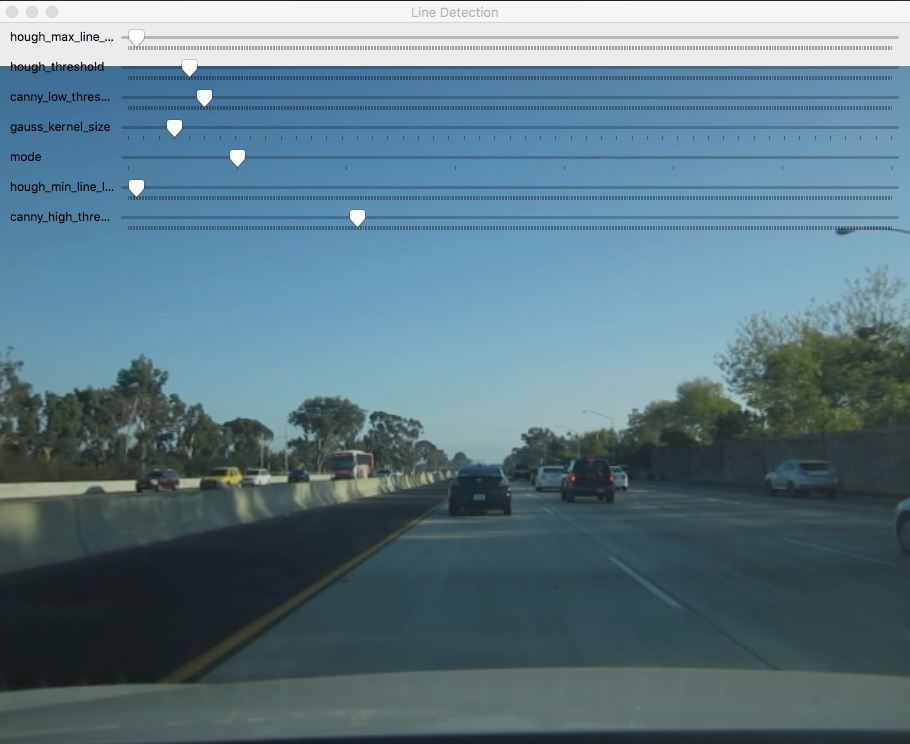

# A Gentle Introduction for Self Driving Car 
**Prototype Finding Straight Lane Lines on the Road

We will use Canny Edge detection and Hough Transform to do our prototype. This proto will help us to distinguish the best comparison of filters to perform straight lane detection. We will use Python3.5 and OpenCV library.
