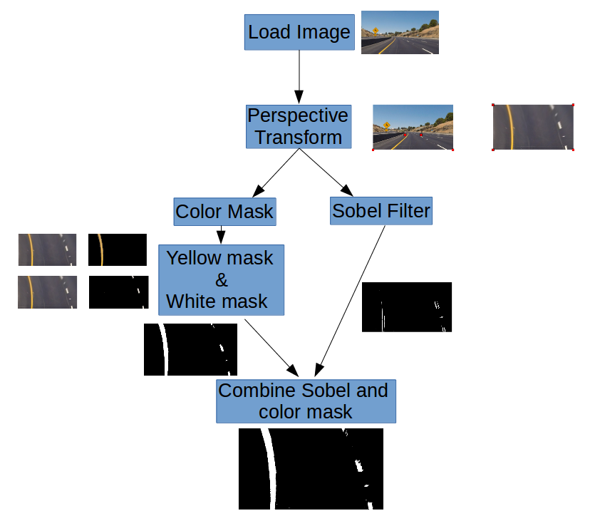

# A Gentle Introduction for Self Driving Car
## Prototype Finding Lane Lines on the Road

We will use Canny Edge detection and Hough Transform to do our prototype. This proto will help us to distinguish the best comparison of filters to perform straight lane detection. We will use Python3.5 and OpenCV library.

## Second Class Discussion

We know that lane finding is important in terms of self-driving car development. Very similar approach to any intelligent agent. We conclude that there is two steps regarding the algorithm. the first step we apply a perspective transform and compute a lane mask to identify potential locations of lane in an image, and in the next step we combine the lane mask information with previous frame information to compute the final lane. The second step is performed to discard effects of noisy or get the lane mask. 

Below is the Flow chart how we can solve the problem

